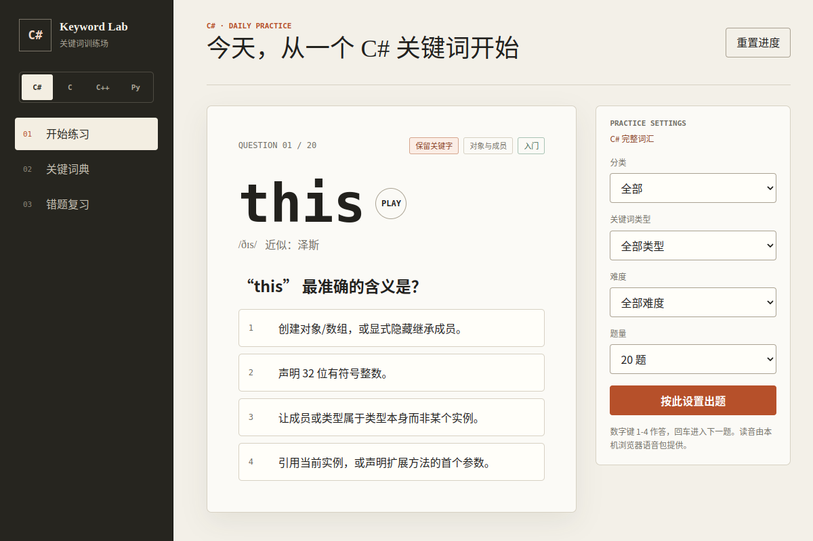
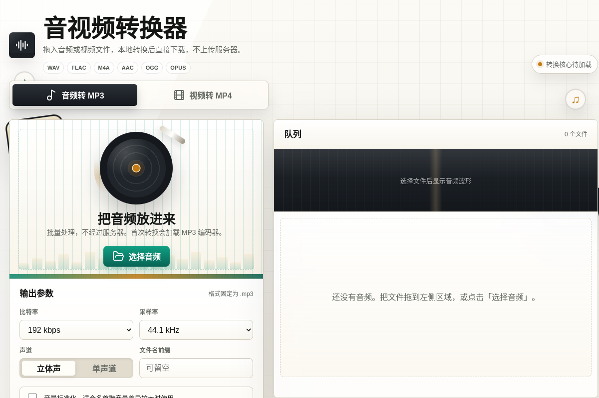
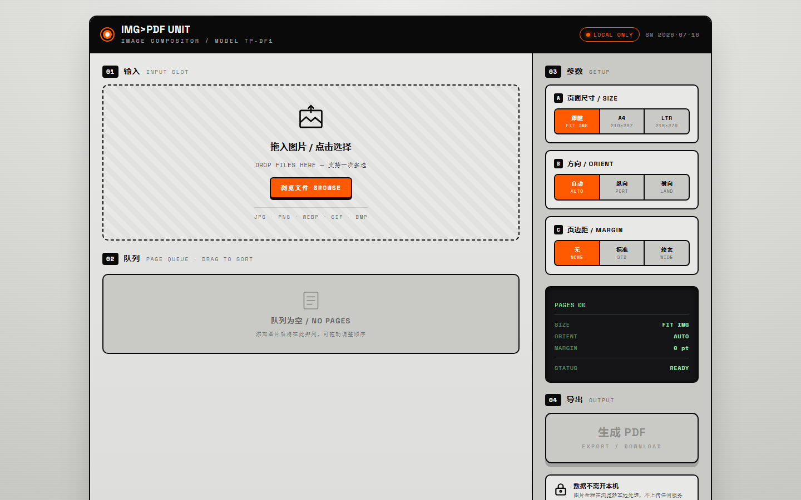
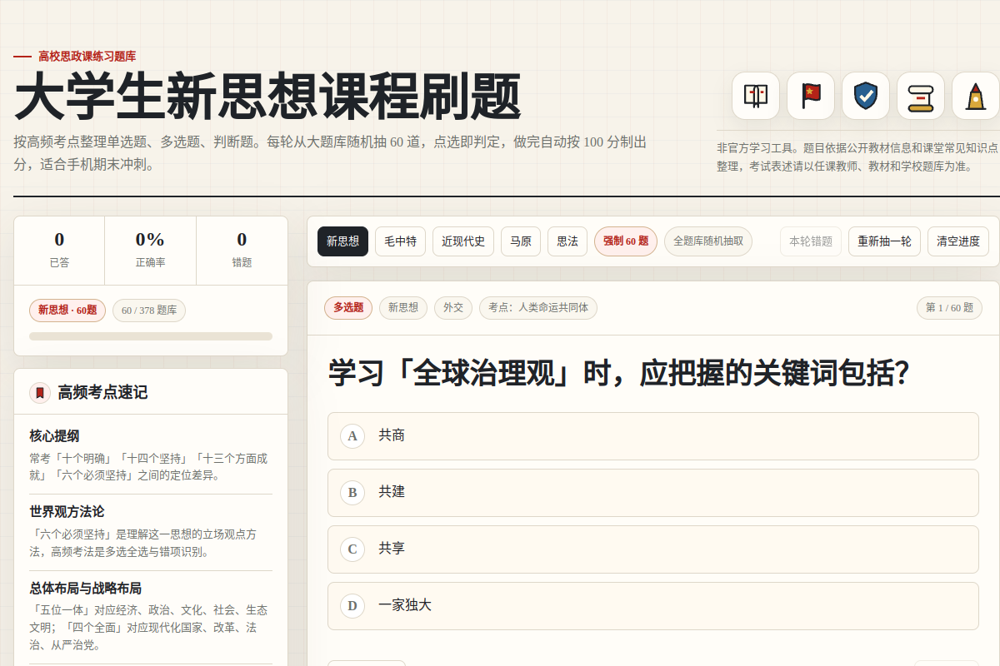

# xyw 在线工具

这个仓库收录了多个可以直接访问的纯前端网页工具，覆盖编程语言学习、音视频转换、图片合成 PDF 和高校课程复习。工具无需安装桌面软件，处理记录与用户文件默认保留在本机浏览器中。

## 编程语言关键词训练场

在线地址：

[https://nuyoahxyw.github.io/xyw/](https://nuyoahxyw.github.io/xyw/)

*界面预览：左侧切换语言与学习视图，中间完成四选一练习，右侧按分类、类型、难度和题量生成题目。*

用于系统学习 C#、C、C++ 与 Python 的语言关键字。页面把保留关键字、上下文关键字和软关键字分开整理，每个词条均包含 IPA 音标、中文近似读音、详细解释、最小代码示例和容易混淆的知识点。

题库范围：

- C#：77 个保留关键字与 45 个上下文关键字，共 122 项
- C17：44 个标准关键字
- C++20：92 个保留关键字与 4 个上下文标识符，共 96 项
- Python 3.13：35 个保留关键字与 4 个软关键字，共 39 项

特点：

- 可按语言、关键词类型、知识分类和难度筛选题目
- 提供随机四选一练习、关键词典、详细答题解析和错题复习
- 支持浏览器原生英文朗读，并显示 IPA 与中文近似读音
- 数字键 `1-4` 可直接作答，按回车进入下一题
- 四种语言的掌握度、答题记录和错题分别保存在本机
- 页面不依赖后端服务，下载完整文件后也可离线使用

## 音视频格式转换器

在线地址：

[https://nuyoahxyw.github.io/xyw/audio-converter.html](https://nuyoahxyw.github.io/xyw/audio-converter.html)

*界面预览：顶部切换音频转 MP3 或视频转 MP4，左侧拖入文件并设置输出参数，右侧查看波形、队列、进度与下载结果。*

用于在浏览器中批量转换常见音频和视频文件。文件会在本机解码、编码并生成下载结果，不会上传到远程服务器。页面提供“音频转 MP3”和“视频转 MP4”两种工作模式。

特点：

- 音频输入支持 MP3、WAV、FLAC、M4A、AAC、OGG、OPUS 和 AIFF 等常见格式
- 视频输入支持 MP4、WebM、MOV、M4V、M4S、OGV、AVI 和 MKV 等浏览器可读取格式
- MP3 可选择 128、192、256 或 320 kbps，以及原采样率、44.1 kHz 或 48 kHz
- 支持单声道/立体声切换、音量标准化和输出文件名前缀
- MP4 可选择 2.5、5 或 8 Mbps 视频质量
- 支持多文件拖入、批量转换、转换进度、音频波形和逐项下载
- 视频转 MP4 采用浏览器播放捕获与本地录制，速度接近视频时长；M4S 需是可独立播放的非加密片段，大文件会占用较多内存

> 文件内容不会上传，但页面需要联网加载图标库与 MP3 编码器。视频转 MP4 是否可用取决于当前浏览器对 MP4 `MediaRecorder` 的支持。

## 图片合成 PDF

在线地址：

[https://nuyoahxyw.github.io/xyw/img-to-pdf.html](https://nuyoahxyw.github.io/xyw/img-to-pdf.html)

*界面预览：左侧拖入并按顺序排列图片，中间设置页面尺寸、方向与页边距，右侧一键导出合成后的 PDF。*

用于把多张图片按指定顺序合成为一个 PDF 文件。图片全程在浏览器本地解码与排版，不上传任何服务器，导出的 PDF 直接在本机生成并下载。

特点：

- 支持 JPG、PNG、WEBP、GIF、BMP 等常见图片格式，可一次多选
- 拖拽调整页面顺序，实时预览队列与页数
- 页面尺寸可跟随图片或选择 A4（210×297）、Letter（216×279）
- 方向支持自动、纵向、横向，页边距可选无、标准或较宽
- 图片全程在浏览器本地处理，不上传任何服务器
- 页面需要联网加载 jsPDF 库，加载后即可离线合成

> 图片不会上传，但页面需要联网加载 jsPDF 库与字体。

## 思政课程刷题库

在线地址：

[https://nuyoahxyw.github.io/xyw/sizheng-quiz.html](https://nuyoahxyw.github.io/xyw/sizheng-quiz.html)

*界面预览：顶部切换五门课程，左侧显示答题统计和高频考点，主区域完成随机题目并即时查看判断结果。*

用于高校思政课程期末复习，包含单选题、多选题和判断题。选择课程后，页面会从对应完整题库中随机抽取 60 道题；点选后立即显示正误，完成整轮后按 100 分制计算成绩。

已包含课程：

- 习近平新时代中国特色社会主义思想概论：378 题
- 毛泽东思想和中国特色社会主义理论体系概论：362 题
- 中国近现代史纲要：111 题
- 马克思主义基本原理：114 题
- 思想道德与法治：114 题

特点：

- 五门课程共收录 1079 道练习题
- 每轮从当前课程随机抽取 60 题，支持重新抽题
- 侧栏显示已答数量、正确率、错题数量和答题进度
- 提供课程对应的高频考点速记
- 可收藏重点题目，并在页面下方集中复习
- 完成后显示总分、本轮错题和逐题解析
- 当前课程和各课程答题进度分别保存在浏览器中
- 采用响应式布局，电脑与手机浏览器均可使用

> 题目为学习练习用途，依据公开教材知识点和课堂常见考点整理。考试表述请以任课教师、教材和学校题库为准。
